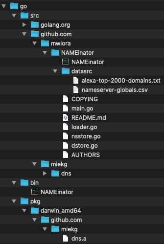

# Quick Steps

1. Install Go (macOS package installer from https://golang.org/doc/install)

2. `$ go get github.com/mwiora/NAMEinator`

3. `$ go get github.com/miekg/dns`

4. `$ cd ~/go/src/github.com/mwiora/NAMEinator/`

5. `$ go build`

6. `$ ./NAMEinator`

Folder structure

## Result

starting NAMEinator - version custom
understood the following configuration: {numberOfDomains:100 debug:false contest:true nameserver:}
....................................................................................................

NOTE: as this is an alpha - we rely on feedback - please report bugs and featurerequests to https://github.com/mwiora/NAMEinator/issues and provide this output
OS: darwin ARCH: amd64
....................................................................................................

trying to load nameservers from datasrc/nameserver-globals.csv
trying to load domains from datasrc/alexa-top-2000-domains.txt
LETS GO - each dot below is a completed domain request against all nameservers
....................................................................................................
finished - presenting results:

2001:470:20::2:
Avg. [0s], Min. [0s], Max. [0s]

1.1.1.1:
Avg. [9.36687ms], Min. [4.784471ms], Max. [140.080277ms]

76.76.19.19:
Avg. [24.186606ms], Min. [10ms], Max. [338.909641ms]

8.8.8.8:
Avg. [29.635545ms], Min. [5.008531ms], Max. [220.239398ms]

1.0.0.1:
Avg. [34.000864ms], Min. [4.946472ms], Max. [736.796831ms]

8.8.4.4:
Avg. [34.787306ms], Min. [4.235114ms], Max. [189.760275ms]

68.237.161.12:
Avg. [45.674706ms], Min. [3.519661ms], Max. [397.753062ms]

209.244.0.4:
Avg. [48.903267ms], Min. [3.582184ms], Max. [274.10582ms]

149.112.112.112:
Avg. [49.768679ms], Min. [4.893614ms], Max. [326.683025ms]

192.168.1.1:
Avg. [51.476256ms], Min. [5.187166ms], Max. [327.233122ms]

208.67.220.220:
Avg. [52.51001ms], Min. [4.595406ms], Max. [1.226333052s]

209.244.0.3:
Avg. [60.931765ms], Min. [3.876387ms], Max. [322.270212ms]

208.67.222.222:
Avg. [62.856185ms], Min. [4.218288ms], Max. [1.279479731s]

76.223.122.150:
Avg. [64.007986ms], Min. [10ms], Max. [2.001553619s]

9.9.9.9:
Avg. [71.936666ms], Min. [4.792184ms], Max. [1.604175468s]

68.237.161.14:
Avg. [92.042232ms], Min. [3.466509ms], Max. [1.532975978s]

216.146.35.35:
Avg. [100.05922ms], Min. [9.104575ms], Max. [2.004016652s]

94.140.15.15:
Avg. [131.192587ms], Min. [10ms], Max. [641.888429ms]

94.140.14.14:
Avg. [134.483547ms], Min. [10ms], Max. [424.62096ms]

156.154.71.1:
Avg. [137.181578ms], Min. [9.935507ms], Max. [2.00251322s]

216.146.36.36:
Avg. [694.984763ms], Min. [10ms], Max. [2.004916256s]

Au revoir!

## Tested DNS Servers

This table includes providers' **primary** (or **preferred**) and **secondary** (or **alternate**) DNS servers. Primary and secondary DNS servers can be "mixed and matched" from different providers to protect you if the primary provider has problems.

IP | Descr. | Hostname | Purpose | Notes
--- | --- | --- | --- | ---
94.140.14.14 / 94.140.15.15 | [AdGuard DNS](https://adguard.com/en/adguard-dns/overview.html) | dns.adguard.com | | Blocks ads in games, videos, apps, and web pages, and also malware and phishing websites.
76.76.19.19 / 76.223.122.150 | [Alternate DNS](https://alternate-dns.com/) | dns.alternate-dns.com | | Blocks ads before they reach your network.
1.0.0.1 / 1.1.1.1 | [Cloudflare](https://1.1.1.1/dns/) | one.one.one.one | <ul><li><b>Speed</b></li><li><b>Privacy</b></li></ul> | Will never log your IP address, never sell your data, and never use your data to target ads.
8.8.8.8 / 8.8.4.4 | [Google Public DNS](https://developers.google.com/speed/public-dns/) | dns.google | <ul><li><b>Speed</b></li></ul> | Promises three core benefits: a faster browsing experience, improved security, and accurate results without redirects.
208.67.222.222 / 208.67.220.220 | [OpenDNS](https://www.opendns.com/) | resolver1.opendns.com / resolver2.opendns.com | <ul><li><b>Speed</b></li><li><b>Reliability</b></li><li><b>Filtering</b></li><li><b>Parental Controls</b></li></ul> | Claims 100% reliability. Capability to predict cyberattacks before they happen. It provides noticeably fast internet connection, and offers security intelligence as well as web filtering.
192.168.1.1 | Internal 192-1-1 | Fios_Quantum_Gateway.fios-router.home
68.237.161.12 / 68.237.161.14 | Verizon DNS | nsnyny01.verizon.net / nsnyny02.verizon.net | <ul><li><b>Assigned by ISP</b></li><li><b>DNS Hijacks</b></li></ul>| Verizon FiOS Regional DNS Servers for NYC. Supposedly, the default address given out is the ".12" address which utilizes **DNS Hijacking** to serve you ads from Verizon. Each region has a corresponding ".14  DNS server which does not hijack DNS.
156.154.71.1 | UltraDNS | rdns2.ultradns.net | <ul></li><li><b>DNS Hijacks</b></li></ul> | More for commercial use.
216.146.35.35 / 216.146.36.36 | DynGuide | rdns.dynect.net
9.9.9.9 / 149.112.112.112 | [Quad9](https://www.quad9.net/) | dns.quad9.net | | Has free public DNS servers that protect your computer and other devices from cyber threats by immediately and automatically blocking access to unsafe websites, without storing your personal data. Quad9 does not filter content—only domains that are phishing or contain malware will be blocked.
209.244.0.3 / 209.244.0.4 | Level3 | resolver1.level3.net / resolver2.level3.net |  | Its infrastructure, though great and reliable, is not as huge as Google’s.
